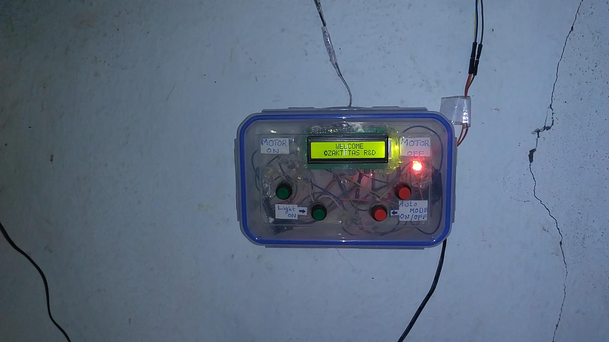
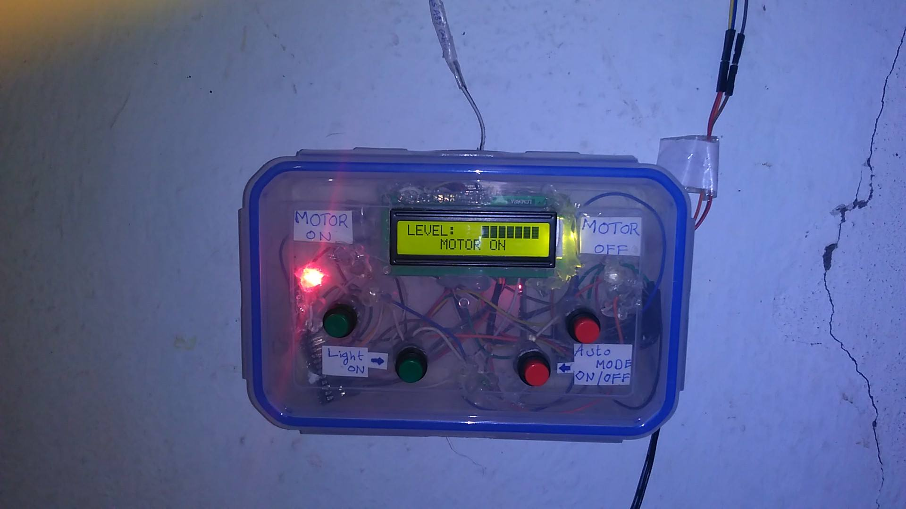
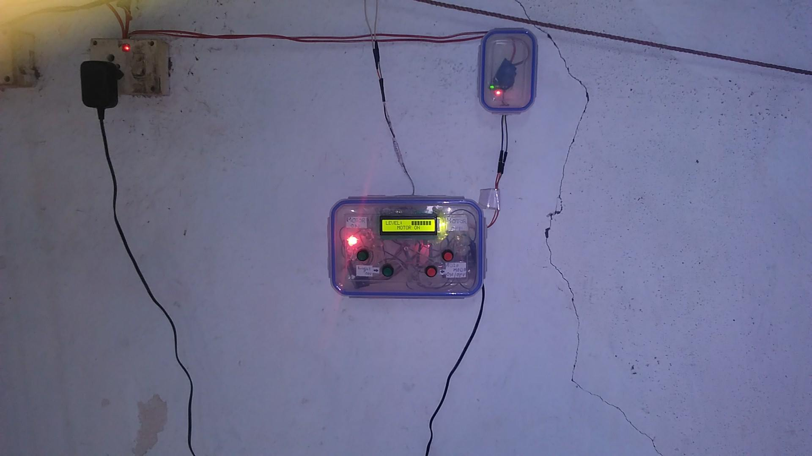

# Water tank Monitor and motor automation System by using arduino
#### code-name:helium
##### Description:
  - This is simple overhead water tank level monitor and motor automation using arduinos , ultrasonic sensor, rs-485 modules, 16x2 lcd, push switchs and indicator leds
  - They are actual two nodes , one at user side, one at the tank side, if you consider client -server model here, the node at tank side acts like a server, the main node (user controllable) is acts like client, it will sends the request for the values
  - Each node consists a arduino-pro-mini(or any other), a RS-485 module
  - In addition the remote node that is at water tank side consits a ultrasonic(HC5005) sensor 
  - In addition the local node that is client side have , 16x2 LCD , indicator leds and Push Buttons
  - The local node sends the requests to remote node , The remote nodes calulate the distance between the top of tank to water level, if water level is low, the distance is high, water level is high, distance is low , after calulating  send the diatance back to the local node 
  - According to that values the local node calulate the levels and displays on it 16x2 LCD and takes automatics actions like auto motor ON , motor OFF
  - The comunication between the local and remote node by using RS-485, which is half duplex, UART, and diffrential comunication system , The maxmimum distance betweeen two nodes which are connected by RS-485 is 1000 meters
  
##### Images of system in real-time:
  - 
  - 
  - 